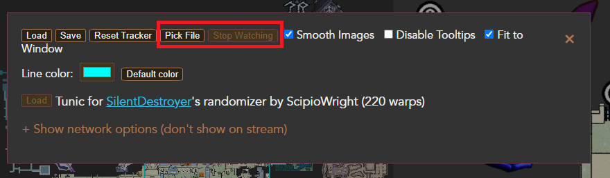
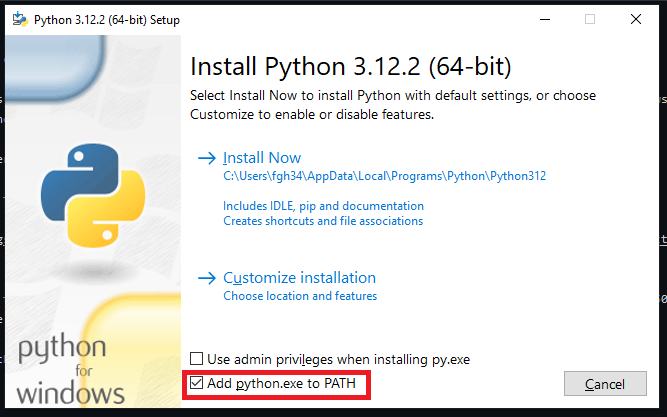

#How to Use

To use this, download the source code zip and open the file called "index.html" with your browser.

The automation ability only works in Chromium based browsers, with the spoiler enabled, and if things are in the default windows places. If you want to try getting the auto tracker to work under other conditions feel free to ask for help.

Probably compatible with Ranomizer Mod 3.0.2 (probably compatible with 3.1.0)

This webpage behaves the same as the original entrace tracker except it has two new buttons in settings.

Pick File: Choose the tunic file that is created by the auto tracking script located at USER_NAME\\Documents\\2024-1-31_12.50.50_tunic-tracker.txt and when this file updates so will the tracker
Stope Watching: Stop watching the save file so updates are no longer automatic

The auto tracker scripts is a python file located at

auto_tracker/auto_tracker.py

This will require Python 3.10+ to run: https://www.python.org/downloads/

When installing Python make sure to click the option to add python.exe to the PATH.

# Origainl Tunic Entrance Tracker

This is most a copy of Scipio's Tunic Entrance Tracker https://scipiowright.gitlab.io/tunic-tracker/

Which was a fork of...

Here is a link to the original, which this is forked off of:
https://sekii.gitlab.io/pokemon-tracker

## License
The code is under the [MIT License](code/LICENSE.txt). Original code by Sekii.

Data, fonts and images belong to their own copyright holders.
